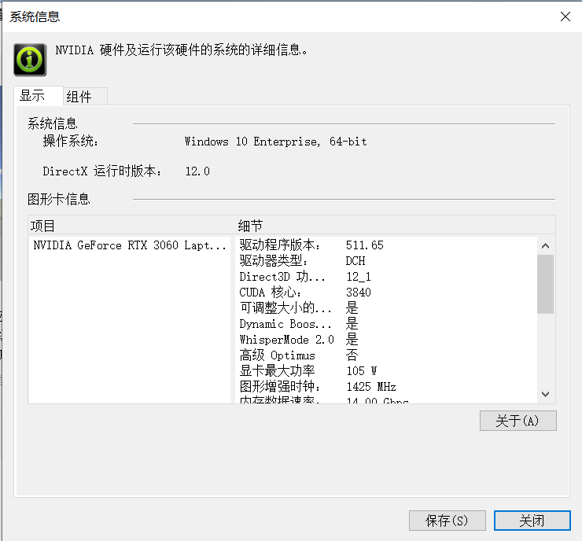
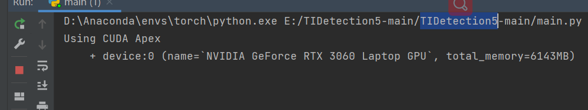
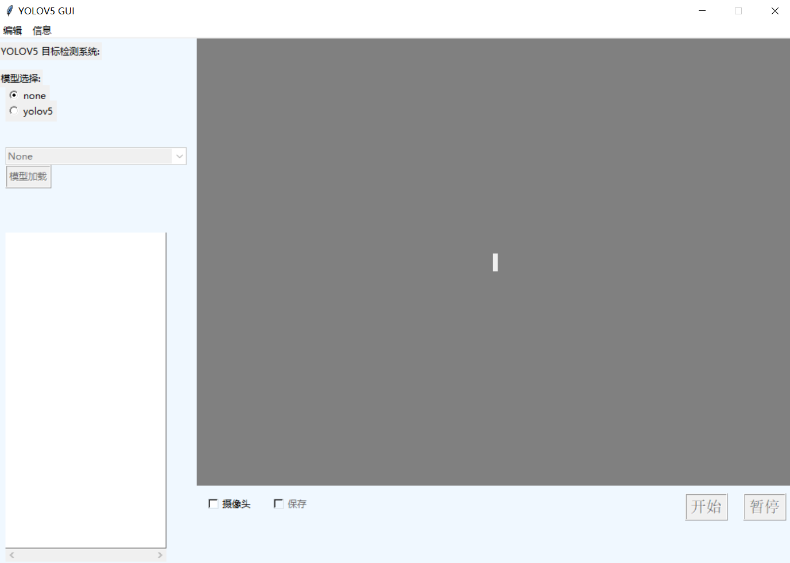
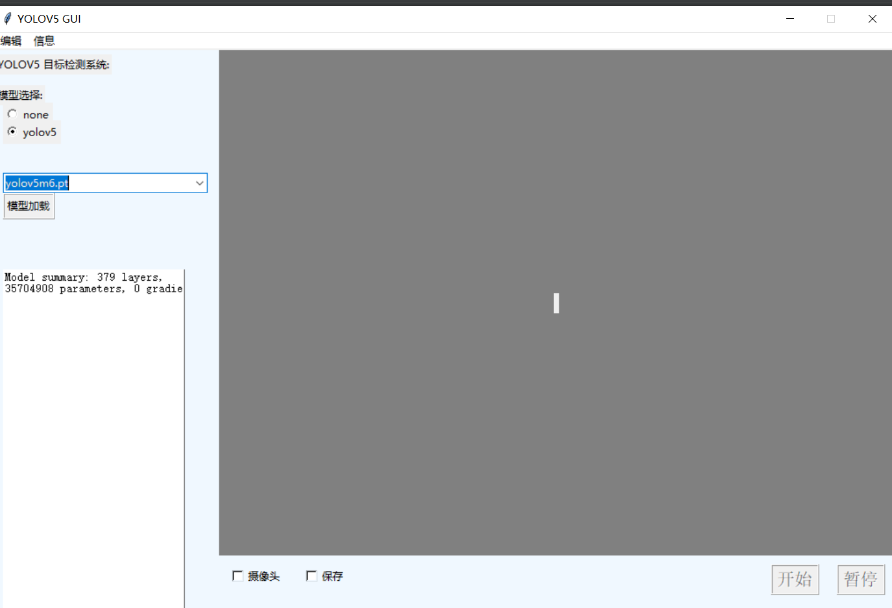
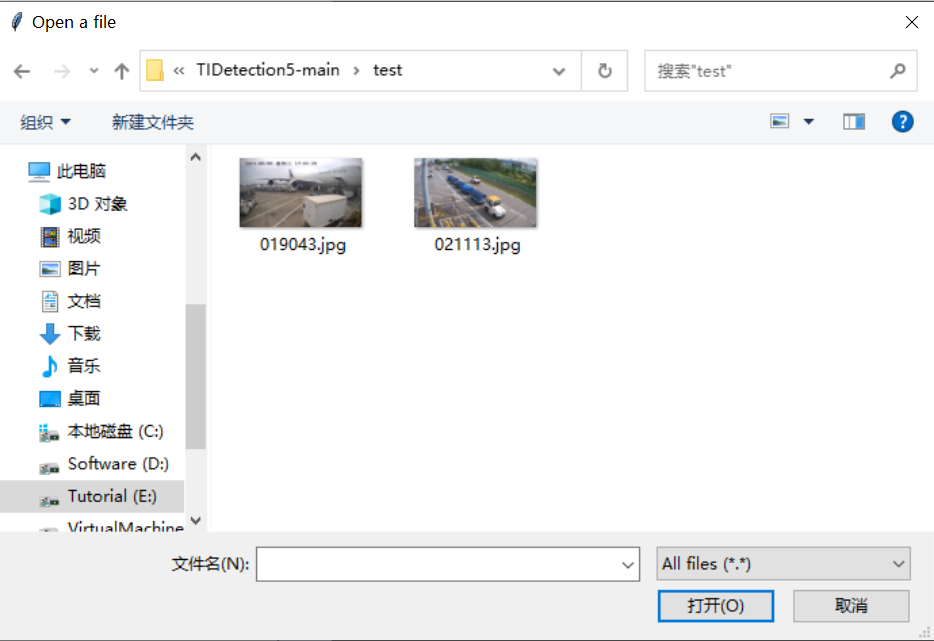
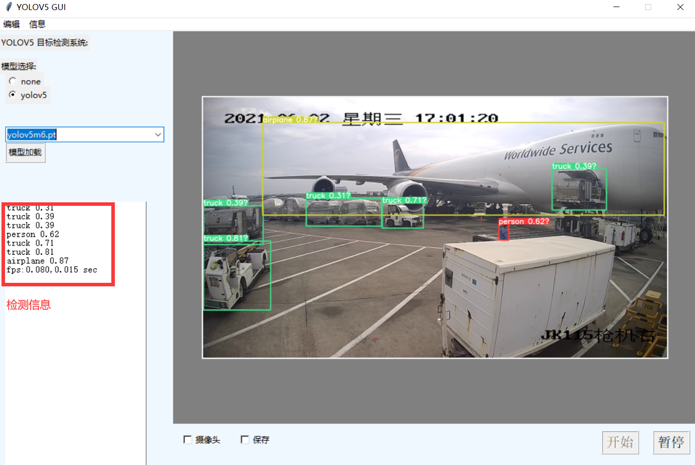
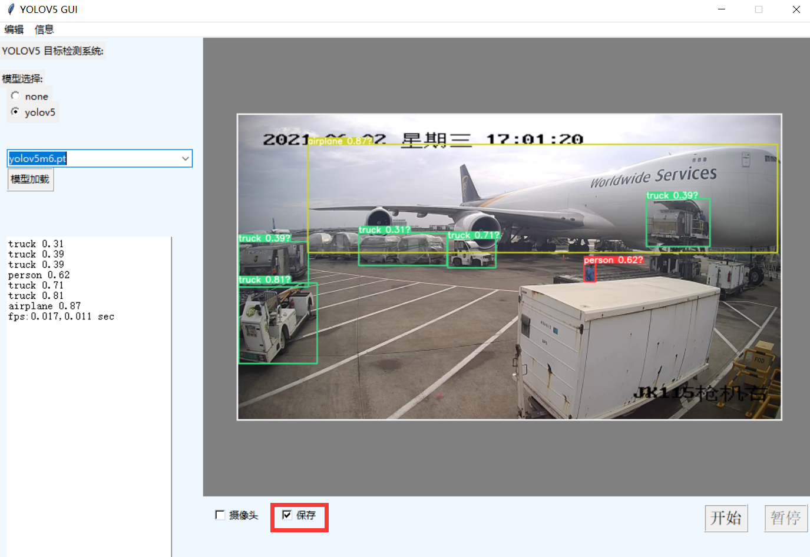
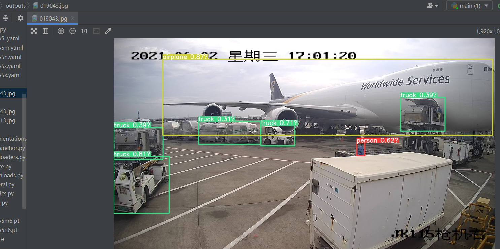
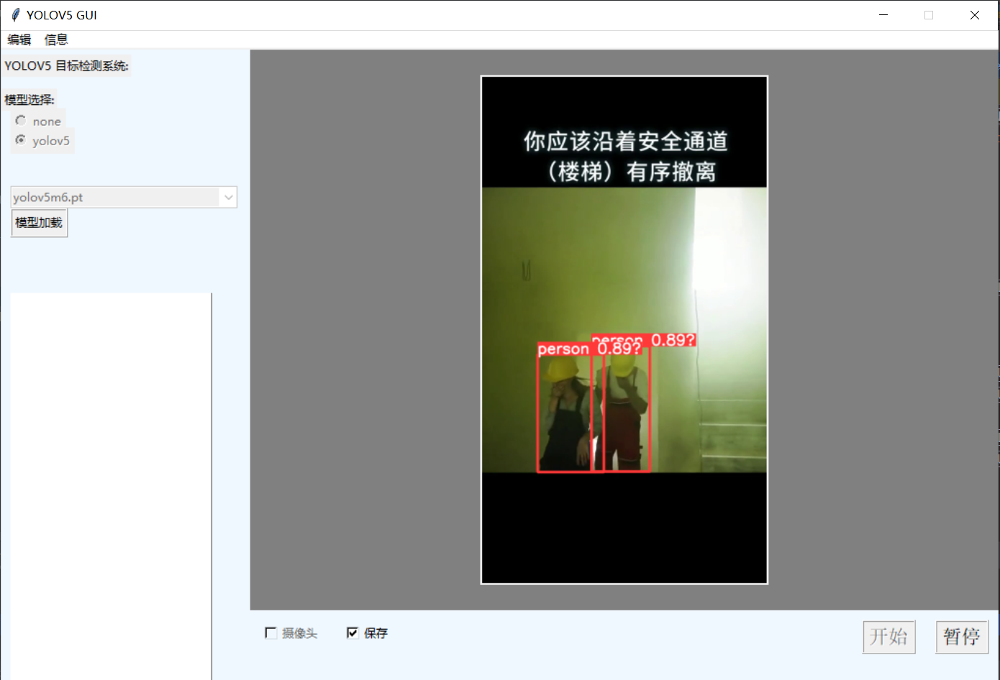
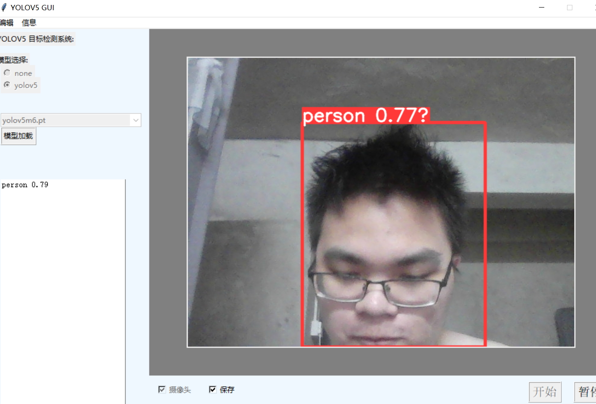

## 项目介绍


本项目基于 yolov5n6 和tkinker实现的检测模型的可视化界面

项目连接； 


## 环境： 


硬件： 本人电脑的显卡是  RTX 3060 ，并配置Pytorch-GPU

关于 pytorch 安装查看官方文档 [PyTorch Get Started docs](https://pytorch.org/get-started/locally/) 

<br>

软件: Pycharm 和相关的Python包


```bash
# GUI
Tkinter
# OpenCV
opencv-contrib-python>=4.6.0.66
# PyTorch + GPU CUDA
torch==1.11.0+cu115 torchvision==0.12.0+cu115 torchaudio==0.11.0 -f https://download.pytorch.org/whl/torch_stable.html
```

项目安装依赖

```bash
pip install -r requirements.txt  # install
```

整个项目的 模型下载
[TensorRT, TensorFlow Edge TPU and OpenVINO Export and Inference:](https://github.com/ultralytics/yolov5/releases)
```bash
weights -|- yolov5n6.pt
         |- yolov5m6.pt
```

## 项目功能 


1) 实现图像正常目标检测
2) 实现视频正常目标检测
3) 实现摄像头正常目标检测
4) 实现对目标检测的画面和视频进行保存


## 项目演示

项目运行：

配置好相关环境和依赖，可以执行main.py

```python
python main.py
```


<br>

<br>


点击yolov5，添加yolov5m6.pt模型，点击模型加载

<br>

在编辑中添加图片或者视频 

<br>


图片检测检测结果； 

<br>


如果在检测前，点击了图片保存



那么图像检测的结果在output文件夹中进行保存




同样，可以上传视频进行检测，如果想保存视频需要在上传前，点击保存按钮



如果遇到，图片视频上传检测不了，请麻烦将中文路径进行去除

点击摄像头，将对电脑的摄像头进行目标检测



## 如何自定义检测

在 weights文件夹中添加自定义检测训练的pt模型。 模型需要通过 yolov5n6.pt等进行预训练

在detect.py 中的 set_modul函数更换模型和数据训练的yaml配置文件


关于项目遇到环境问题和测试问题，请联系


